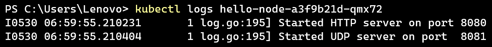

# Adpro - Deployment to Kubernetes
Haliza N. S. Arfa | 2306211401 | Adpro A

---

## Hello Minikube

**Compare the application logs before and after you exposed it as a Service. Try to open the app several times while the proxy into the Service is running. What do you see in the logs? Does the number of logs increase each time you open the app?**

Sebelum di-expose, log menunjukkan pesan awal bahwa HTTP server dimulai pada port 8080 dan UDP server pada port 8081.

Setelah di-expose, muncul log baru yakni permintaan GET. Setiap kali aplikasi dibuka atau di-refresh, entri log bertambah.

**Notice that there are two versions of `kubectl get` invocation during this tutorial section. The first does not have any option, while the latter has `-n` option with value set to `kube-system`. What is the purpose of the `-n` option and why did the output not list the pods/services that you explicitly created? Hint: Do some reading about [Namespace in Kubernetes documentation](https://kubernetes.io/docs/concepts/overview/working-with-objects/namespaces/).**

Opsi `-n` pada perintah `kubectl get` digunakan untuk menentukan namespace tertentu di Kubernetes. Tanpa opsi ini, perintah hanya menampilkan resource dari namespace default. Namespace digunakan untuk memisahkan resource dalam satu cluster. Jadi, saat memakai `-n kube-system`, yang ditampilkan adalah resource sistem Kubernetes. Sedangkan resource yang dibuat sendiri biasanya ada di namespace default, jadi tidak akan muncul jika hanya melihat `kube-system`.