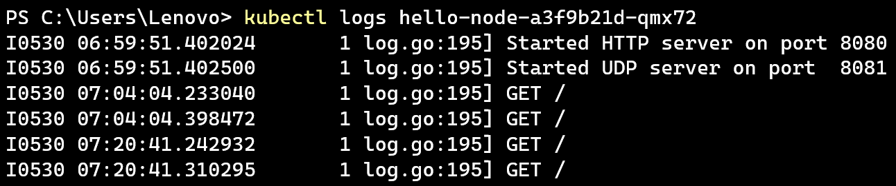

# Adpro - Deployment to Kubernetes
Haliza N. S. Arfa | 2306211401 | Adpro A

---

## Hello Minikube

**Compare the application logs before and after you exposed it as a Service. Try to open the app several times while the proxy into the Service is running. What do you see in the logs? Does the number of logs increase each time you open the app?**

Sebelum di-expose, log menunjukkan pesan awal bahwa HTTP server dimulai pada port 8080 dan UDP server pada port 8081.


Setelah di-expose, muncul log baru yakni permintaan GET. Setiap kali aplikasi dibuka atau di-refresh, entri log bertambah.



**Notice that there are two versions of `kubectl get` invocation during this tutorial section. The first does not have any option, while the latter has `-n` option with value set to `kube-system`. What is the purpose of the `-n` option and why did the output not list the pods/services that you explicitly created? Hint: Do some reading about [Namespace in Kubernetes documentation](https://kubernetes.io/docs/concepts/overview/working-with-objects/namespaces/).**

Opsi `-n` pada perintah `kubectl get` digunakan untuk menentukan namespace tertentu di Kubernetes. Tanpa opsi ini, perintah hanya menampilkan resource dari namespace default. Namespace digunakan untuk memisahkan resource dalam satu cluster. Jadi, saat memakai `-n kube-system`, yang ditampilkan adalah resource sistem Kubernetes. Sedangkan resource yang dibuat sendiri biasanya ada di namespace default, jadi tidak akan muncul jika hanya melihat `kube-system`.


## Rolling Update & Kubernetes Manifest File

**What is the difference between Rolling Update and Recreate deployment strategy? Hint: Read the Deployments documentation.**

Strategi Rolling Update dan Recreate berbeda dalam caranya memperbarui aplikasi yang sedang berjalan di Kubernetes. Rolling Update melakukan pembaruan secara bertahap, pod baru dijalankan satu per satu sambil mempertahankan sebagian pod lama tetap aktif sehingga aplikasi tetap tersedia selama proses update. Sementara itu, Recreate akan mematikan semua pod lama terlebih dulu sebelum menjalankan pod baru, yang bisa menyebabkan layanan tidak tersedia untuk sementara. Rolling Update lebih ideal untuk aplikasi yang membutuhkan availability tinggi, sedangkan Recreate lebih cocok jika versi aplikasi lama dan baru tidak bisa berjalan bersamaan karena alasan teknis, seperti konflik dependency atau resource.


**Try deploying the Spring Petclinic REST using Recreate deployment strategy and document your attempt.**

Untuk mencoba strategi Recreate, saya memodifikasi file deployment yang sebelumnya digunakan. Di dalam file baru, saya menyesuaikan konfigurasi deployment dengan menambahkan bagian strategi bertipe Recreate. Setelah dilakukan konfigurasi, saya menerapkan deployment tersebut menggunakan `kubectl apply -f deployment_recreate.yaml`.


Aplikasi berhasil dijalankan, dan endpoint /petclinic bisa diakses seperti biasa setelah `minikube service` dijalankan ulang.


**Prepare different manifest files for executing Recreate deployment strategy.**

Saya membuat file manifest baru bernama deployment_recreate.yaml, yang merupakan penyesuaian dari file deployment sebelumnya. Perbedaannya terletak pada bagian `strategy`, di mana dilakukan perubahan dari `RollingUpdate` menjadi `Recreate`. Dengan file ini, deployment akan mengikuti cara kerja Recreate, yaitu menghentikan pod lama sebelum menjalankan yang baru.

```yaml
...
  strategy:
    type: Recreate
...
```

**What do you think are the benefits of using Kubernetes manifest files? Recall your experience in deploying the app manually and compare it to your experience when deploying the same app by applying the manifest files (i.e., invoking `kubectl apply -f` command) to the cluster.**

Menurut saya, penggunaan manifest file dalam Kubernetes sangat membantu dalam mengurangi risiko kesalahan saat deployment. Semua konfigurasi tertulis dengan jelas dalam file, sehingga tidak perlu lagi dilakukan langkah-langkah secara manual yang bisa rawan salah. Manifest file membuat proses deployment lebih cepat, konsisten, dan mudah diulang. Ini jauh lebih efisien dibandingkan harus mengetikkan perintah satu per satu setiap kali ingin melakukan perubahan atau update aplikasi.